# 画像のパス、名前、切り抜く範囲を指定する
設定しやすい用に、先頭に定数（厳密な意味では定数でないが）として設定している。
```Python
IMG_PATH = "data/sample/Google-Logo.jpg"
# IMG_PATH = "data/sample/sea-free-photo5.jpg"
# IMG_PATH = "data/sample/fresh-fruits-2305192_960_720.jpg"
```
`IMG_PATH`で画像ファイルを指定する。サンプルで3枚画像を用意している。
- Googleのロゴ
- 風景の写真
- フルーツの写真

```Python
IMG_NAME = IMG_PATH.split("/")[-1]
START_X, START_Y = 0, 0
RANGE_X, RANGE_Y = 1500, 1000
NUMBER_OF_CLUSTERS = 5
```
- `IMG_NAME`で、画像ファイル名を指定する。
- `START_X, START_Y`で、切り抜き位置を指定する。
- `RANGE_X, RANGE_Y`で、どのくらいのピクセル分切り取るか指定する。
- `NUMBER_OF_CLUSTERS`で、K-平均のクラスタ数を指定する。

# K-平均法
## そもそもK-平均法とは？
**K-平均法（K-means clustering）** は、クラスタリングの手法の1つで、与えられたデータセットをK個のクラスタに分割するアルゴリズムです。

具体的には、まずK個の中心点をランダムに設定します。その後、各データポイントがそれぞれ最も近い中心点に属するようにクラスタに割り当てます。次に、各クラスタの中心を再計算し、その中心を新しい中心点として使い、再度クラスタリングを行います。このプロセスを繰り返し、各中心点が変化しなくなるまで続けます。

K-平均法はマーケティング調査や自然言語処理にも使われますが画像処理でも使うことができます。画像中のピクセル値をベクトル化し、そのベクトルを元に似た特徴を持つ画像をクラスタリングすることができます。

## K-meansアルゴリズムの収束基準を設定する
```Python
criteria = cv2.TERM_CRITERIA_MAX_ITER + cv2.TERM_CRITERIA_EPS, 10, 1.0
```
cv2.TERM_CRITERIA_MAX_ITER:反復回数が最大値に達した場合に収束判定を行うフラグ
cv2.TERM_CRITERIA_EPS:クラスタ中心が移動する距離がしきい値以下になった場合に収束判定を行うフラグ

```
criteria = cv2.TERM_CRITERIA_MAX_ITER + cv2.TERM_CRITERIA_EPS, 10, 1.0
```
であれば、最大反復回数が10で、移動量の閾値が1.0

```Python
_, labels, rgb_value = cv2.kmeans(
    data=colors,  # クラスタリングするための入力データ
    K=self.number_of_cluster,  # クラスタ数
    bestLabels=None,  # クラスタ番号の初期値(通常はNone)
    criteria=criteria,  # アルゴリズムの収束基準
    attempts=10,  # 異なる初期値でアルゴリズムを実行する回数
    flags=cv2.KMEANS_RANDOM_CENTERS,  # クラスタリングアルゴリズムのフラグ
)
```

戻り値は以下の3つ
compactness:各点とその所属するクラスタ中心との距離の総和。
labels:各データ点の所属するクラスタのラベル。
centers:クラスタの中心点の座標の配列。要は画像の場合は、RGBのリストになっている。

# サンプル画像でK-平均をやってみる。

## Google のロゴ
### 元画像

### K=5
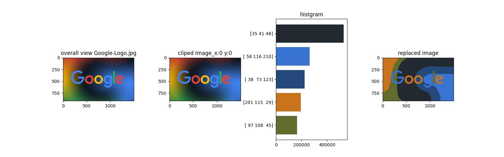
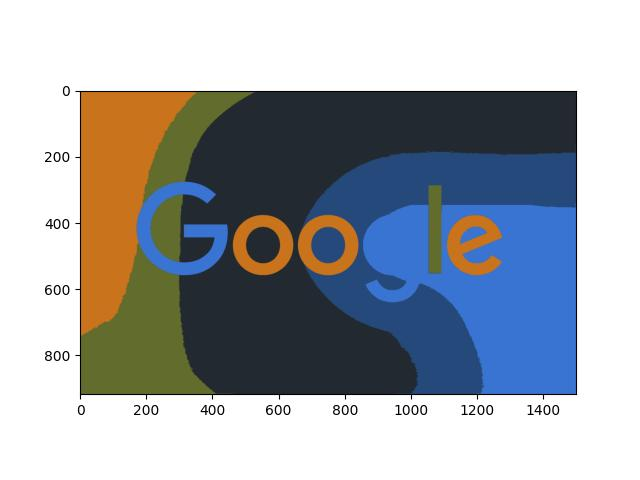
### K=10
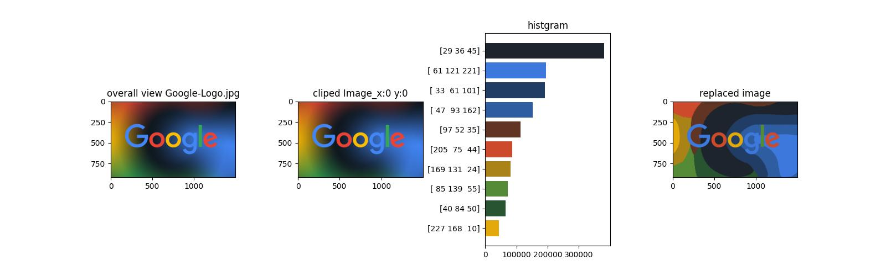
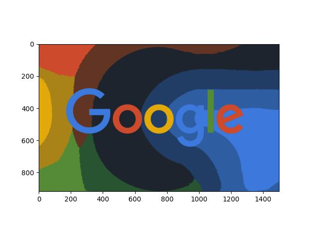
### K=20
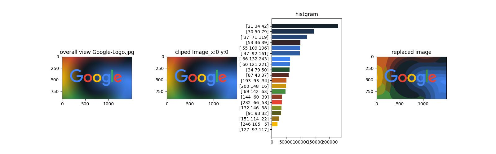
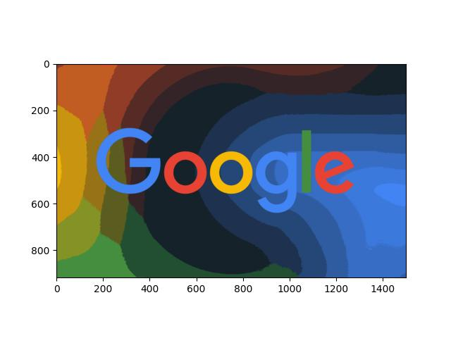
### K=50
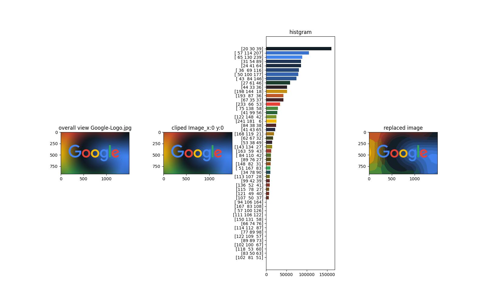


## フルーツの写真
### 元画像
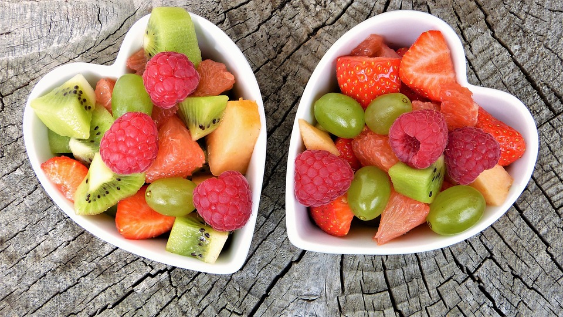
### K=5
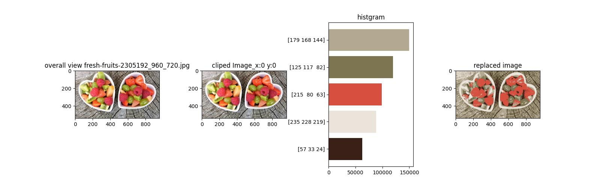
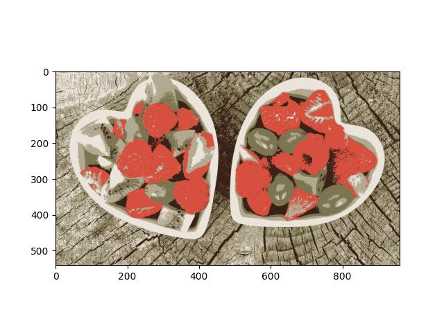
### K=10

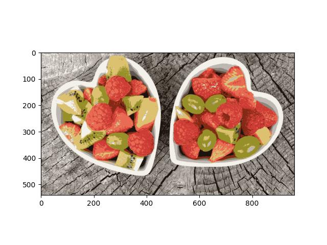
### K=20
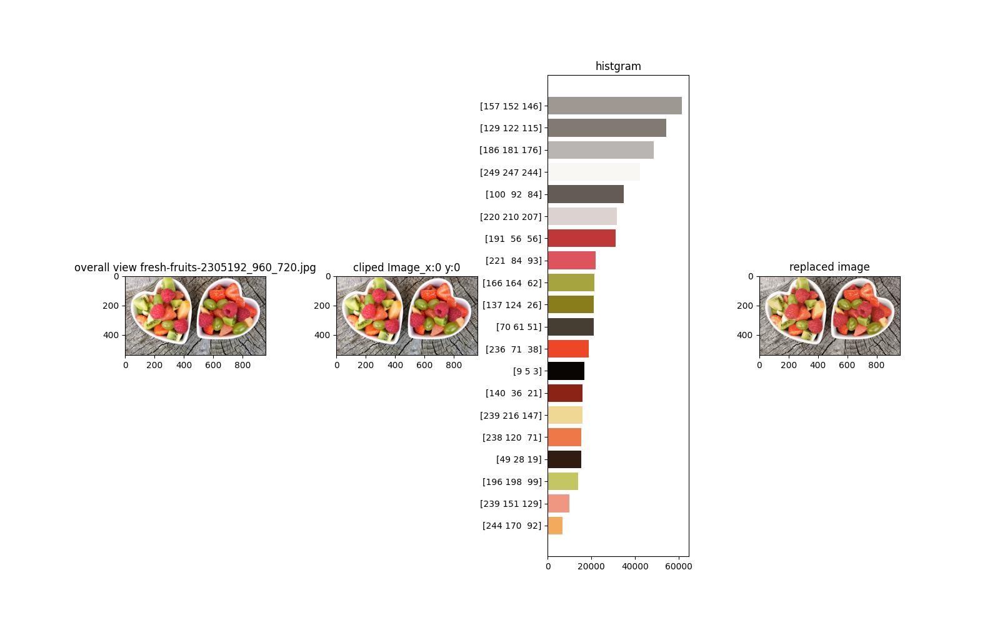
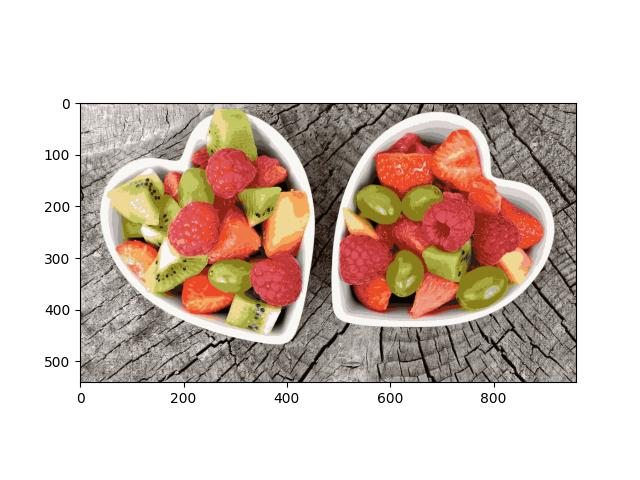
### K=50
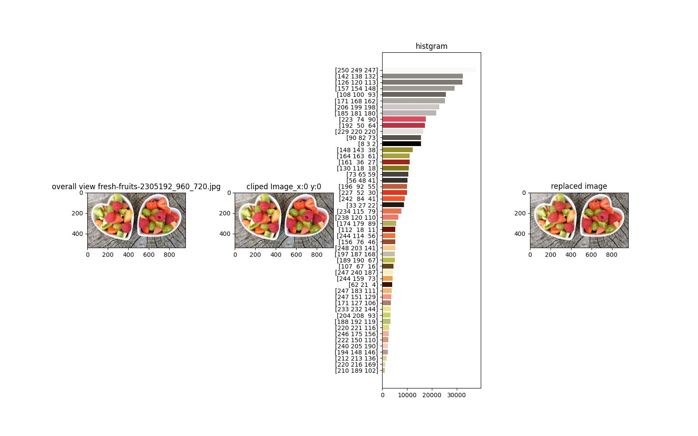
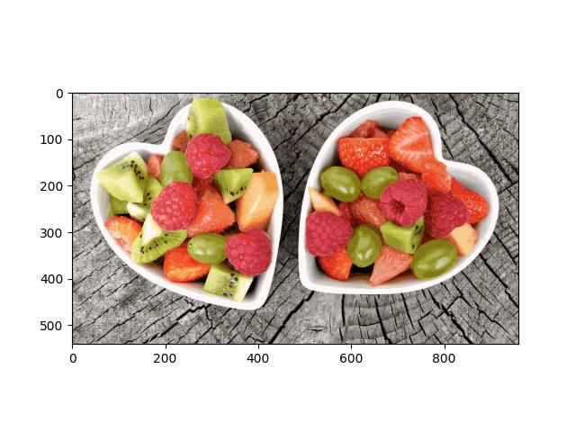

## 山と海
### 元画像

### K=5
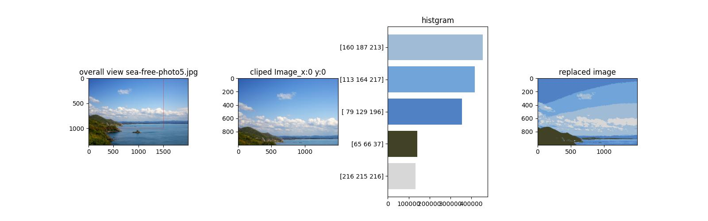
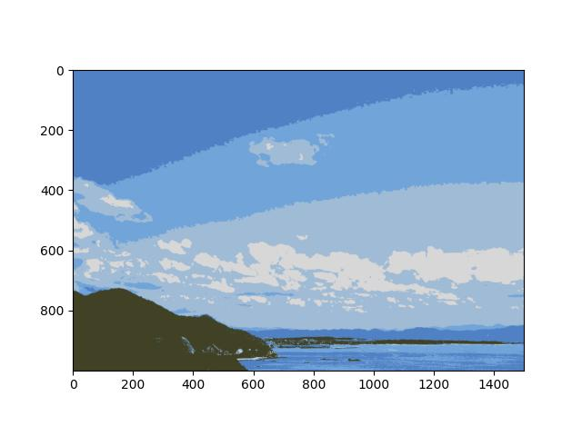
### K=10
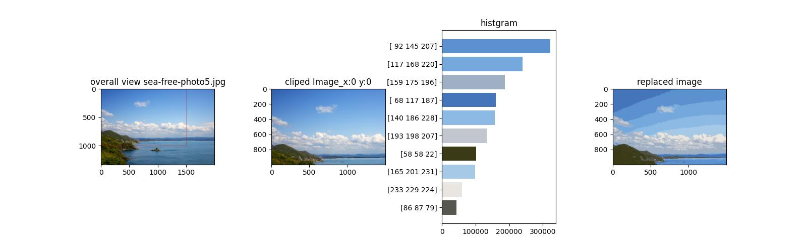
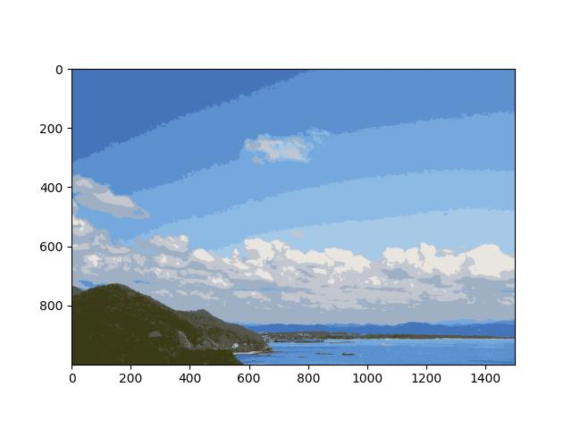
### K=20

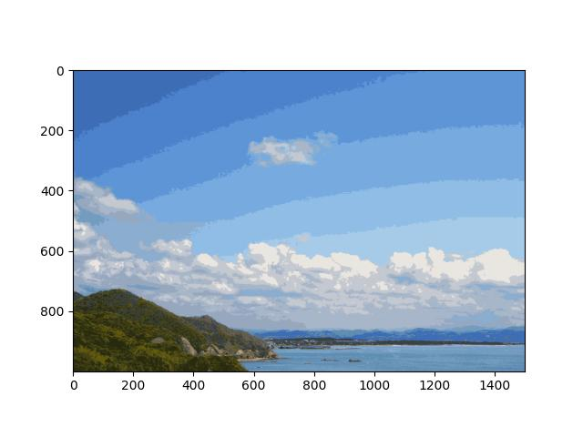
### K=50
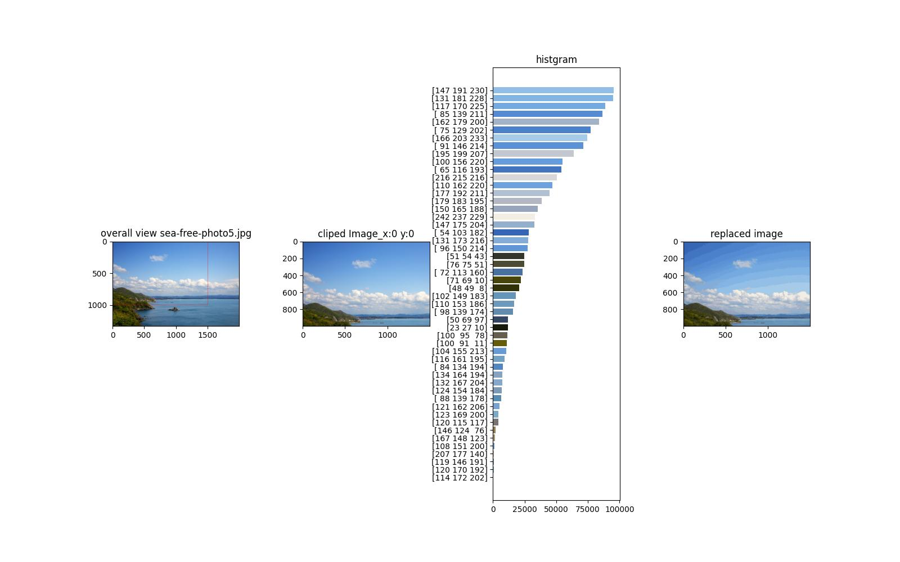

