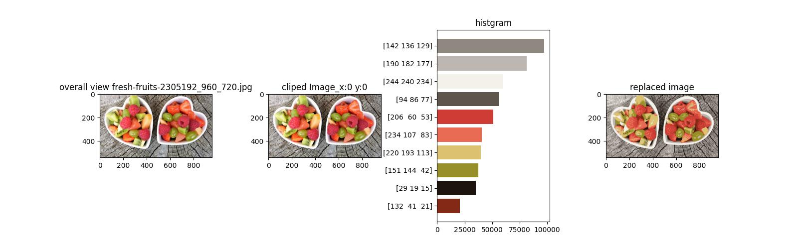
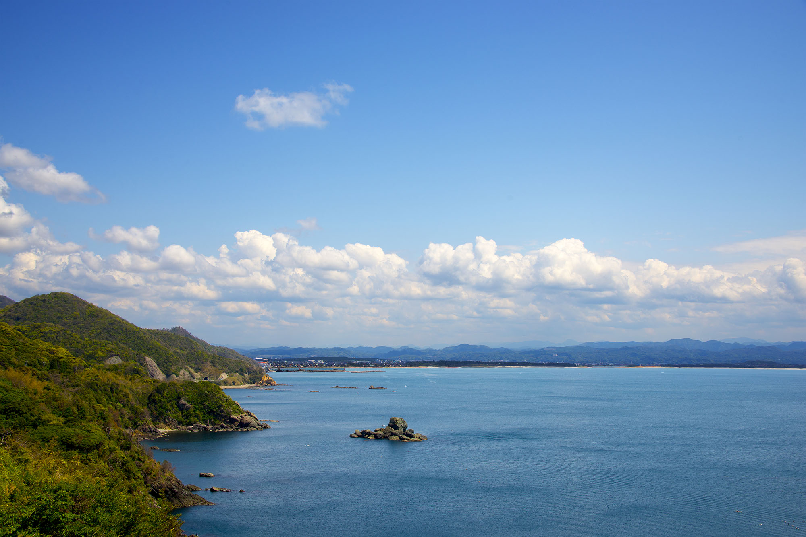
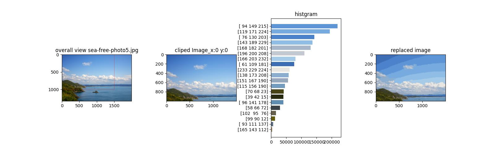

# 概要
画像処理においてもよく使用されるクラスタリングアルゴリズムの一つである**K-平均法**を使って、画像分析する方法をまとめてます。
K-平均法で分析することで、その画像には「どんな種類の色が含まれているか」知ることができます。

## そもそもK-平均法とは？
**K-平均法（K-means clustering）** は、クラスタリングの手法の1つで、与えられたデータセットをK個のクラスタに分割するアルゴリズムです。

具体的には、まずK個の中心点をランダムに設定します。その後、各データポイントがそれぞれ最も近い中心点に属するようにクラスタに割り当てます。次に、各クラスタの中心を再計算し、その中心を新しい中心点として使い、再度クラスタリングを行います。このプロセスを繰り返し、各中心点が変化しなくなるまで続けます。

K-平均法はマーケティング調査や自然言語処理にも使われますが画像処理でも使うことができます。画像中のピクセル値をベクトル化し、そのベクトルを元に似た特徴を持つ画像をクラスタリングすることができます。

知っての通り、画像はRGBデータの集合体です。色自体はRGBの256×256×256=16,777,216種類あります。これをK-平均法で大体どれくらいの色が含まれているのかを知ることができます。

# ライブラリのインストール
必要なライブラリは以下でインストールする。
``` bash
pip3 install -r requirements.txt
```

# 画像のパス、名前、切り抜く範囲を指定する
設定しやすい用に、先頭に定数（厳密な意味では定数でないが）として設定している。
```Python
IMG_PATH = "data/sample/Google-Logo.jpg"
# IMG_PATH = "data/sample/sea-free-photo5.jpg"
# IMG_PATH = "data/sample/fresh-fruits-2305192_960_720.jpg"
```
`IMG_PATH`で画像ファイルを指定する。サンプルで3枚画像を用意している。
- Googleのロゴ
- 風景の写真
- フルーツの写真

```Python
IMG_NAME = IMG_PATH.split("/")[-1]
START_X, START_Y = 0, 0
RANGE_X, RANGE_Y = 1500, 1000
NUMBER_OF_CLUSTERS = 5
```
- `IMG_NAME`で、画像ファイル名を指定する。
- `START_X, START_Y`で、切り抜き位置を指定する。
- `RANGE_X, RANGE_Y`で、どのくらいのピクセル分切り取るか指定する。
- `NUMBER_OF_CLUSTERS`で、K-平均のクラスタ数を指定する。例えば、5と指定すれば5つの色に分類します。数値が大きくなるほど計算量が多くなるため、時間がかかります。

# K-平均法

## K-meansアルゴリズムの収束基準を設定する
```Python
criteria = cv2.TERM_CRITERIA_MAX_ITER + cv2.TERM_CRITERIA_EPS, 10, 1.0
```
cv2.TERM_CRITERIA_MAX_ITER:反復回数が最大値に達した場合に収束判定を行うフラグ
cv2.TERM_CRITERIA_EPS:クラスタ中心が移動する距離がしきい値以下になった場合に収束判定を行うフラグ

```
criteria = cv2.TERM_CRITERIA_MAX_ITER + cv2.TERM_CRITERIA_EPS, 10, 1.0
```
であれば、最大反復回数が10で、移動量の閾値が1.0

```Python
_, labels, rgb_value = cv2.kmeans(
    data=colors,  # クラスタリングするための入力データ
    K=self.number_of_cluster,  # クラスタ数
    bestLabels=None,  # クラスタ番号の初期値(通常はNone)
    criteria=criteria,  # アルゴリズムの収束基準
    attempts=10,  # 異なる初期値でアルゴリズムを実行する回数
    flags=cv2.KMEANS_RANDOM_CENTERS,  # クラスタリングアルゴリズムのフラグ
)
```

戻り値は以下の3つ
compactness:各点とその所属するクラスタ中心との距離の総和。
labels:各データ点の所属するクラスタのラベル。
centers:クラスタの中心点の座標の配列。要は画像の場合は、RGBのリストになっている。

# 図の出力

```Python
class MakeFigure:
    def __init__(self, dataframe, overall_image, cliped_image, rgb_value, labels):
        print(dataframe)
        self.df = dataframe  # DataFrame
        self.number_of_cluster = NUMBER_OF_CLUSTERS  # クラスタ数
        self.overall_image = overall_image  # 全体画像
        self.cliped_image = cliped_image  # 切り抜き画像
        self.rgb_value = rgb_value  # RGB値
        self.labels = labels  # 図専用ラベル

    def output_overall_image(self, ax):
        ax.imshow(self.overall_image)

    def output_cliped_image(self, ax):
        ax.imshow(self.cliped_image)

    def output_histgram(self, ax):
        rgb_value_counts = (
            self.df.loc[:, ["counts"]].to_numpy().flatten().tolist()
        )  # ヒストグラム用のrgb値カウント数

        bar_color = (
            self.df.loc[:, ["plt_R_value", "plt_G_value", "plt_B_value"]]
            .to_numpy()
            .tolist()
        )  # ヒストグラム用のrgb値カウント数

        bar_text = self.df.loc[:, ["plt_text"]].to_numpy().flatten()  # ヒストグラム用x軸ラベル

        # ヒストグラムを表示する。
        ax.barh(
            np.arange(self.number_of_cluster),
            rgb_value_counts,
            color=bar_color,
            tick_label=bar_text,
        )

    def output_replaced_image(self, ax):
        # 各画素を k平均法の結果に置き換える。
        self.dst = self.rgb_value[self.labels].reshape(self.cliped_image.shape)
        ax.imshow(self.dst)
```

このクラスで結果の図の出力を行っています。
- ax1：全体画像
- ax2：切り取り指定した後の画像
- ax3：K平均法の解析結果のヒストグラム
- ax4：各画素を k平均法の結果に置き換えた画像


# サンプル画像でK-平均をやってみる。

## Google のロゴ
### 元画像

### K=5


### K=10


### K=20


### K=50


## フルーツの写真
### 元画像

### K=5


### K=10


### K=20


### K=50


## 風景の写真
### 元画像

### K=5


### K=10


### K=20


### K=50


